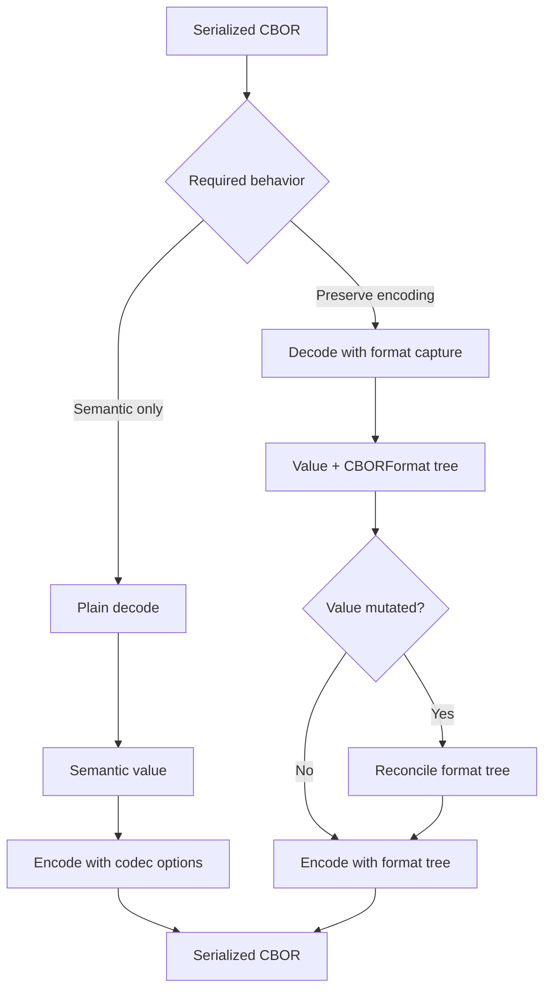
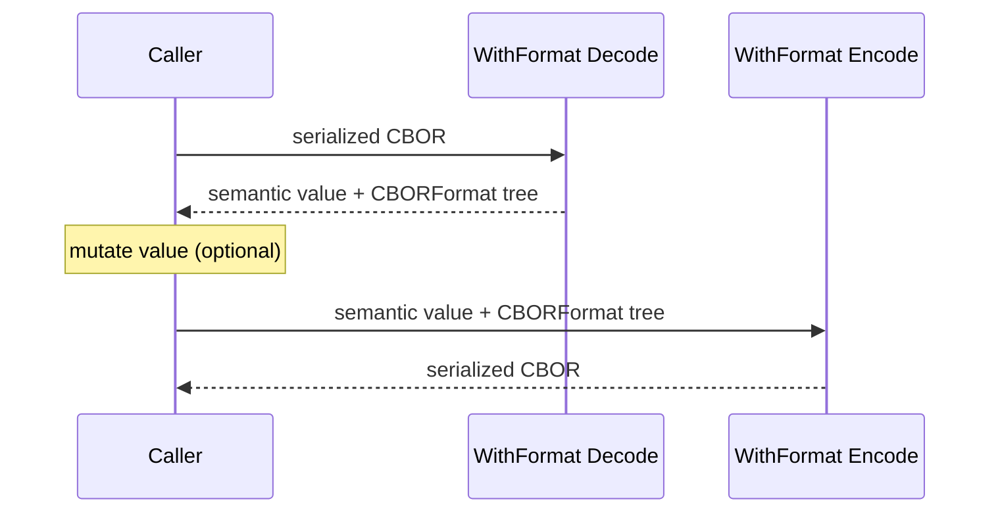
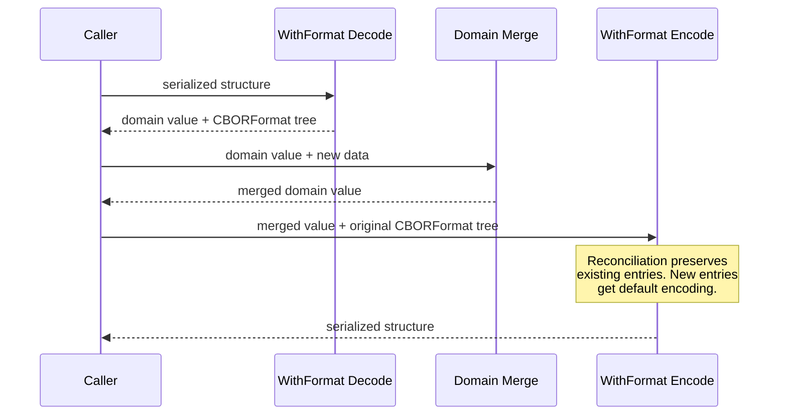

# CBOR Format Preservation Specification

**Version**: 1.0.0  
**Status**: DRAFT  
**Created**: March 10, 2026  
**Authors**: Evolution SDK Team  
**Reviewers**: [To be assigned]

---

## Abstract

This specification defines how the Evolution SDK preserves CBOR serialization shape across decode and encode boundaries. The design introduces an explicit `WithFormat` contract in which decode returns both the semantic value and a recursive `CBORFormat` tree, and encode accepts that tree as the source of serialization instructions. This allows byte-identical round-trips for any domain where re-encoding must not alter the byte representation of data whose hash has already been computed or committed.

---

## Purpose and Scope

This specification establishes the architectural requirements and behavioral contracts for CBOR format preservation within the Evolution SDK.

**Target Audience**: SDK maintainers, contributors implementing CBOR-backed modules, wallet integrators, relay-service authors, and reviewers evaluating serialization behavior.

**Scope**: This specification covers the `CBORFormat` model, the `DecodedWithFormat` result contract, preservation-aware decode and encode entrypoints on `CBOR`, the contract for domain modules that integrate `WithFormat`, and reconciliation behavior when the semantic value no longer matches the captured format tree.

**Out of Scope**: This specification does not define the general `CodecOptions` behavior of plain CBOR encode APIs beyond their interaction boundary with the preservation path. It does not require immediate rollout of `WithFormat` support to every CBOR-backed module in the repository.

---

## Introduction

CBOR has two layers of meaning:

1. the **semantic value** represented by the bytes
2. the **serialized shape** used to encode that value

The semantic value answers questions such as “what integer was encoded?” or “what keys exist in this map?”. The serialized shape answers questions such as “was this integer encoded with a one-byte or two-byte argument?”, “was this array definite or indefinite?”, and “what order were map keys emitted?”.

For many systems, preserving the semantic value is sufficient. In systems where content hashes are derived from raw bytes, it is not. Re-encoding a semantically equivalent structure with a different shape can produce a different hash. Likewise, interoperability with external serializers can depend on preserving container shape or map entry ordering even when the decoded value remains equivalent.

The SDK addresses this by separating two paths:

- a **plain path** for semantic decode and option-driven encode
- a **WithFormat path** for semantic decode plus explicit format capture and replay

### Architectural Overview

### Design Goal

The design goal is not merely “preserve as much as possible”. The design goal is to make preservation behavior explicit, observable, and testable while still allowing safe fallback when the caller mutates the decoded value.

---

## Functional Specification (Normative)

The following requirements are specified using RFC 2119 / RFC 8174 keywords.

### 1. Core Concepts

#### 1.1 Semantic value

A semantic value is the decoded CBOR content without any promise about how that value was serialized.

#### 1.2 Format tree

A format tree is a recursive structure that captures the serialization choices associated with a CBOR value.

#### 1.3 Preservation boundary

The preservation boundary is the point at which the SDK stops treating CBOR as raw bytes and starts treating it as a semantic value plus optional preservation metadata.

The `WithFormat` API defines that boundary explicitly.

### 2. Format Model

The implementation **MUST** expose the following model concepts.

#### 2.1 Byte width

An integer argument width **MUST** be representable as one of:

- inline
- 1 byte
- 2 bytes
- 4 bytes
- 8 bytes

#### 2.2 Container length encoding

Array and map length encoding **MUST** distinguish between:

- definite length
- indefinite length

Definite length **MUST** be able to preserve the width of the length header.

#### 2.3 String encoding

Byte strings and text strings **MUST** distinguish between:

- definite encoding with preserved header width
- indefinite encoding with preserved chunk boundaries and chunk header widths

#### 2.4 `CBORFormat`

The root preservation model **MUST** be a tagged discriminated union with variants for:

- unsigned integer
- negative integer
- byte string
- text string
- array
- map
- tag
- simple value

Each variant **MUST** preserve only the encoding choices relevant to that CBOR node.

#### 2.5 `DecodedWithFormat`

Preservation-aware decode **MUST** return a pair containing:

- the decoded semantic value
- the root `CBORFormat` tree

### 3. `CBORFormat` Semantics

#### 3.1 Unsigned and negative integers

For unsigned and negative integers, the format tree **MUST** preserve the encoded width of the integer argument when that width is explicitly represented in the source bytes.

When the current integer value no longer fits the preserved width, encode **MUST** fall back to the smallest valid width that can represent the value rather than fail.

#### 3.2 Byte strings and text strings

For byte strings and text strings, the format tree **MUST** preserve:

- definite vs indefinite encoding
- header width for definite encoding
- chunk boundaries and chunk header widths for indefinite encoding

#### 3.3 Arrays

For arrays, the format tree **MUST** preserve:

- definite vs indefinite encoding
- definite length header width when applicable
- the child format branch for each element position

#### 3.4 Maps

For maps, the format tree **MUST** preserve:

- definite vs indefinite encoding
- definite length header width when applicable
- serialized key order
- key format and value format for each entry

Serialized key order **MUST** be represented in a form that can be replayed exactly. The preservation model **MUST NOT** reduce map order to a sorting policy.

#### 3.5 Tags

For tags, the format tree **MUST** preserve:

- the width of the tag header
- the child format branch of the tagged payload

#### 3.6 Simple values

For simple values, the format tree **MUST** support a sentinel branch indicating that no richer serialization choice is preserved.

### 4. Preservation-Aware API Surface

#### 4.1 CBOR module

The `CBOR` module **MUST** expose preservation-aware decode and encode entrypoints for:

- bytes → `DecodedWithFormat<CBOR>`
- hex → `DecodedWithFormat<CBOR>`
- `CBOR` + `CBORFormat` → bytes
- `CBOR` + `CBORFormat` → hex

#### 4.2 Domain modules

Any domain module that requires format preservation **SHOULD** expose parallel preservation-aware decode and encode entrypoints that:

- decode raw CBOR through the `CBOR` module
- decode the semantic domain value from that CBOR structure
- return the domain value paired with the original root `CBORFormat`

Domain modules **MUST** follow the same decode and encode contracts defined in Sections 5 and 6.

### 5. Decode Contract

`fromCBOR*WithFormat()` **MUST** capture the format tree during decode of the same byte stream that produced the semantic value.

The decoder **MUST** capture, where applicable:

- integer widths
- string definite vs indefinite shape
- string chunk boundaries
- array definite vs indefinite shape
- map definite vs indefinite shape
- map entry order
- map entry format branches
- tag widths

If the input is invalid CBOR, decode **MUST** fail with a decode error.

### 6. Encode Contract

`toCBOR*WithFormat()` **MUST** interpret the supplied format tree as the source of serialization instructions.

The preservation-aware encode APIs **MUST NOT** accept general codec options. The format tree and codec options would otherwise become competing authorities over the same serialized output.

When the semantic value remains compatible with the captured format tree, preservation-aware encode **SHOULD** produce byte-identical output.

### 7. Reconciliation Rules

When a caller mutates the decoded semantic value before encode, the implementation **MUST** reconcile the format tree locally and continue.

The reconciliation rules are:

1. Format branches whose corresponding value branches are absent **MUST** be dropped.
2. Value branches not covered by the format tree **MUST** use default encoding behavior.
3. Value branches covered by a compatible format branch **MUST** reuse that preserved format branch.
4. Preserved widths that no longer fit the current value **MUST** fall back to a valid width.
5. A stale or partial format tree **MUST NOT** cause encode failure by itself.

### 8. Map Preservation Rules

Map preservation requires stronger guarantees than other container types.

For a map encoded with a preserved format tree, the implementation **MUST**:

- replay preserved keys in their preserved serialized order when those keys still exist
- match preserved keys by semantic CBOR equality rather than object identity
- preserve preserved key and value format branches for surviving entries
- append new keys after preserved entries
- assign default formatting to appended entries when no preserved entry format exists

This rule applies both to low-level CBOR maps and to module-level encode paths that rebuild maps from domain values.

### 9. Error Behavior

The implementation **MUST**:

- throw decode errors for invalid CBOR input
- throw encode errors for invalid semantic values
- reject malformed indefinite containers that do not terminate correctly
- reject invalid tagged integer payloads
- continue encoding when preservation data is partial or stale

---

## Appendix

### Appendix A: Preservation Flows (Informative)

#### A.1. Preservation-aware round-trip

#### A.2. Use case: Cardano transaction witness merge (Informative)

A common consumer of the preservation primitives is Cardano transaction witness merging. The transaction body hash is derived from raw bytes, so re-encoding with a different shape would invalidate the hash. Witness merge uses a WithFormat round-trip:

1. Decode the wallet witness set to extract vkey witnesses as domain values.
2. Decode the full transaction with format capture.
3. Add witnesses at the domain level.
4. Re-encode using the captured format tree.

Reconciliation (Section 7, Section 8) governs the re-encode: body encoding stays stable (preserving the hash), non-witness map entries keep their format branches, map key ordering is preserved for surviving entries, and new witness entries fall back to default encoding.

### Appendix B: Representative Behaviors (Informative)

The current implementation is validated against representative cases including:

- non-minimal unsigned integer encoding
- non-minimal negative integer encoding
- indefinite byte strings
- indefinite text strings
- indefinite arrays
- indefinite maps
- non-minimal tag width
- non-canonical map key order
- non-canonical nested structure bytes
- map-format containers produced by external tooling

### Appendix C: Glossary (Informative)

**Semantic value**: The decoded meaning of CBOR independent of how it was serialized.

**Serialized shape**: The concrete CBOR encoding choices used to represent a semantic value.

**Format tree**: The recursive preservation model that records serialized shape.

**Preservation-aware encode**: Encode that takes an explicit format tree and replays it where compatible.

**Preservation boundary**: The point at which raw CBOR bytes become a semantic value plus optional format metadata. Defined by the `WithFormat` API (Section 1.3).

**Reconciliation**: The fallback behavior applied when a mutated semantic value no longer matches the captured format tree (Section 7).

